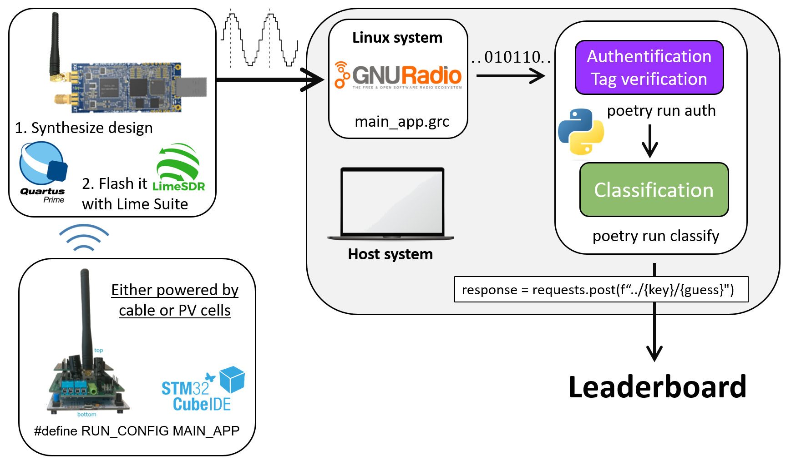

# Integration

This document summarizes the different steps needed to integrate all the
separate parts of this project into one working pipeline.

## Requirements

We assume that you have completed all previous assigments,
and that missing code fragments have been successfully filled.

Make sure that your repository is up-to-date with our main branch, and
that you installed the latest Python dependencies with:

<!-- tell users to run commands from within the root directory or subdirectories -->

```
poetry install
```

Also, make sure to run the above command from the repository directory, or from
any of its subdirectories. The same applies for all `poetry` commands.

## Steps



A working telecommunication chain can be set up by following the steps
summarized in the figure above, and explained hereafter[^1]:

1. _(Any)_ synthesize your RTL design with Quartus and program your LimeSDR-Mini LimeSuite;
2. _(Any)_ program your Nucleo board with STM32CubeIDE, using the MAIN_APP config.;
3. _(Linux)_ open the project files with GNU Radio,
   and generate the Python script(s);
4. _(Linux)_ run your GNU Radio script either from GNU Radio or from the terminal;
5. _(Any)_ in another terminal window, run `poetry run auth | poetry run classify`;
6. and that's all!

> [!IMPORTANT]
> Running `poetry run classify` does not actually submit your classification
> guesses to the leaderboard server. To do so, you will need to add a few
> lines of codes, see the corresponding [README](leaderboard/README.md).

[^1]:
    In parentheses, the host / guest OS that is needed to run the commands.
    Any refers to any OS (best to use your host OS here).

## Customizing

Most parameters in scripts have default values that can be changed in the Python
files, via command-line options, or via environ variables.

For parameters that are use in multiple places, like `melvec_length`,
it is very important to use the same values all across your different
project parts. For those, it is better to use an environ variable,
e.g., `MELVEC_LENGTH=20`.

To setup environ variables, the easiest is to populate the [`.env`](.env) file with
the environ variables. This file is automatically loaded when calling
`flask run auth` or `flask run classify`.
