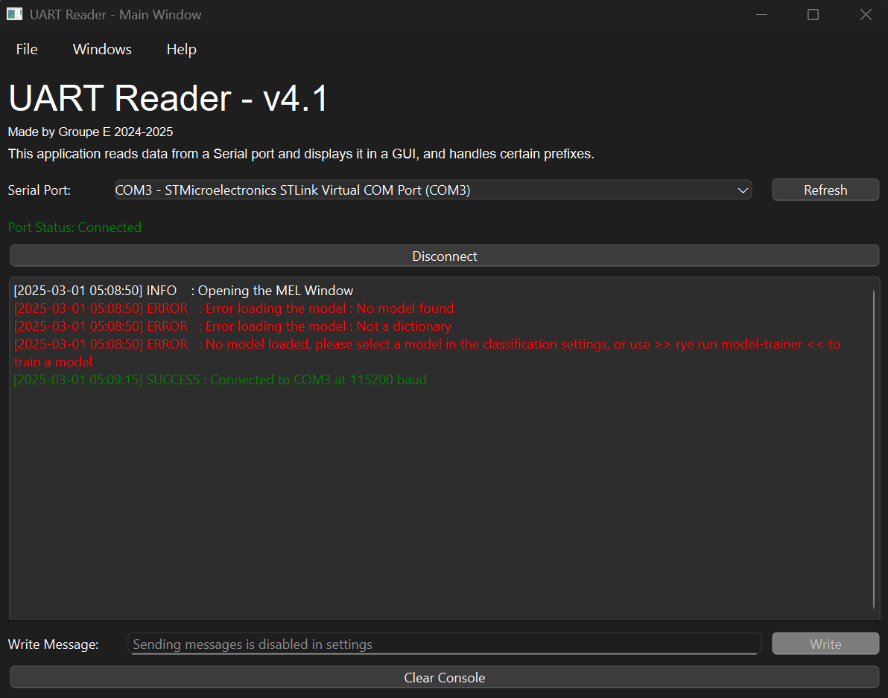
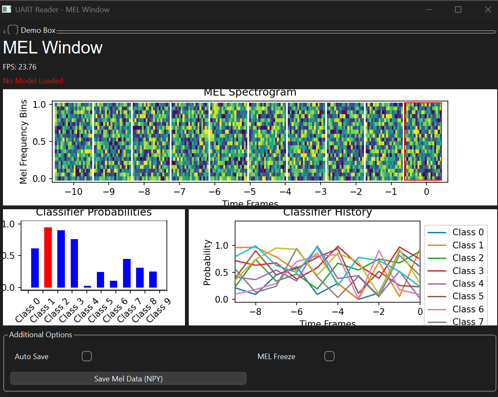

# Contributions

This package contains sub-packages that are contributions from students.

Teaching Assistants reviewed the code before merging, but are not responsible for it.

If you think you also have a piece of code that is worth adding to this project,
please do not hesitate to reach out (via a pull request or by contacting a teaching assistant)!

**List of contributions:**

- [UART Reader](#uart-reader)
  - [Manual](./UART_READER.md)

## UART Reader

- **Location:** `src/contrib/uart_reader/__main__.py`;
- **Contributed by:** Group E, 2024-2025;
- **Description:** provide a graphical interface to read from UART;
- **Script(s):**
  - `uart-reader`, see usage below.
  - `model-trainer`, see usage below.

<p align="center">
    
    
</p>

### Usage

Launching the UART Reader utility requires this command :

```bash
rye run uart-reader <optional flags>
```

To create a classification model that can be used by the UART Reader utilty requires the modification of the `<root>/contrib/src/contrib/uart_reader/model_trainer.py` file, and you must run this command for it to be correctly interpreted by the utility :

```bash
rye run model-trainer
```

> [!NOTE]
> The utility is for the moment, only a GUI based application, and does not have the sufficient capabilities to run only in the console. If you do need such an application, please refer to [Section 1.2 of the Manual](./UART_READER.md#section-12---launching-the-old-utility) on how to use the old version of the uart-reader application. With reduced functionality.

> [!WARNING]
> By default, while using the uart-reader, a [uart_logs.log](./src/contrib/uart_reader/uart_logs.log) file will be created, and will grow as you get packets and serial data. This file is local and alternates between 2 files, as it fills up, it will switch files when it reaches 5MB. This file is at `<root>/contrib/src/contrib/uart_reader/uart_logs.log`.

### Optional Flags

For more information, please refer to [Section 1.1 of the Manual](./UART_READER.md#section-11---launching-the-gui)

### Making your own classifier

For more information, please refer to [Section 1.3 of the Manual](./UART_READER.md#section-13---training-and-using-your-own-classifier)

### Accessing the old stable version

If you want for some reason to use the old version of the uart-reader, then please refer to [Section 1.2 of the Manual](./UART_READER.md#section-12---launching-the-old-utility). Where all steps are given with detail.

---

---
