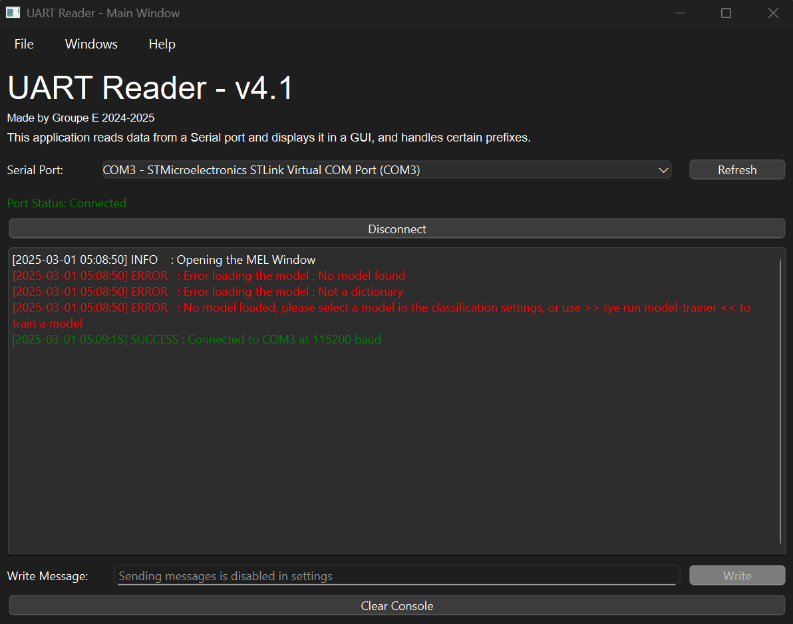
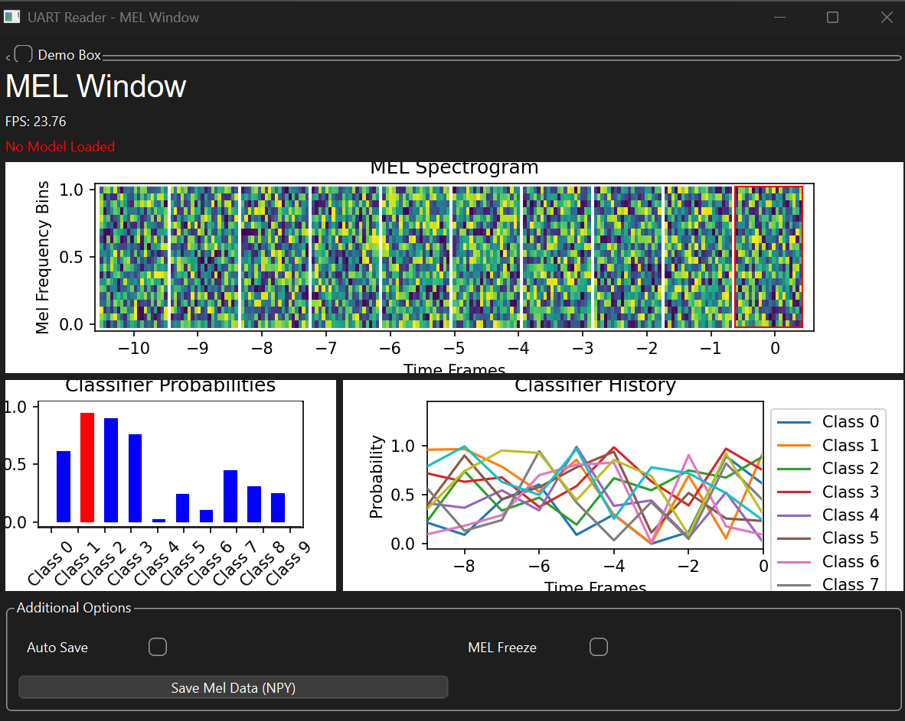

# Contributions

This package contains sub-packages that are contributions from students.

Teaching Assistants reviewed the code before merging, but are not responsible for it.

If you think you also have a piece of code that is worth adding to this project,
please do not hesitate to reach out (via a pull request or by contacting a teaching assistant)!

**List of contributions:**

- [UART Reader](#uart-reader)
  - [Manual](./UART_READER.md)

## UART Reader

- **Location:** `src/contrib/uart_reader/__main__.py`;
- **Contributed by:** Group E, 2024-2025;
- **Description:** provide a graphical interface to read from UART;
- **Script(s):**
  - `uart-reader`, see usage below.
  - `model-trainer`, see usage below.

<p align="center">
    
    
</p>

### Usage

Launching the UART Reader utility requires this command :

```bash
rye run uart-reader <optional flags>
```

To create a classification model that can be used by the UART Reader utilty requires the modification of the `src/contrib/uart_reader/model_trainer.py` file, and you must run this command for it to be correctly interpreted by the utility :

```bash
rye run model-trainer
```

> [!NOTE]
> The utility is for the moment only a GUI based application, and does not have the capacity to run only in the console. If you do need such an application, please refer to the tag bellow to a previous version of this application that has this feature.

### Optional Flags

<!--
@click.option(
    "--logfile",
    default="../uart_logs.log",
    help="Log file to write to",
)
@click.option("--opaudio", is_flag=True, help="Open the audio window")
@click.option("--opmel", is_flag=True, help="Open the MEL window")
@click.option("--modelfile", default="None", help="Classifier model to use")
@click.option("--mel_length", default=20, help="Length of the MEL vectors")
@click.option("--mel_number", default=20, help="Number of MEL vectors in the feature vector")
@click.option("--automel", is_flag=True, help="Automatically save the MEL files")
@click.option("--autoaudio", is_flag=True, help="Automatically save the audio files")
-->

<!-- TODO, update the text above to include the information below -->

### Making your own classifier

### Accessing the old stable version

<!--ADD TAG HERE-->

Please visit the tag <?> to use the previous version of the utility. This older version features a fully implemented and tested CLI interface, so that you can tie it to a command line pipeline. Though, it has only support for audio files, and not the interpretation of mel spectrograms.

<!-- TODO, Add a picture of the old utility here, and the command -->

---
---
