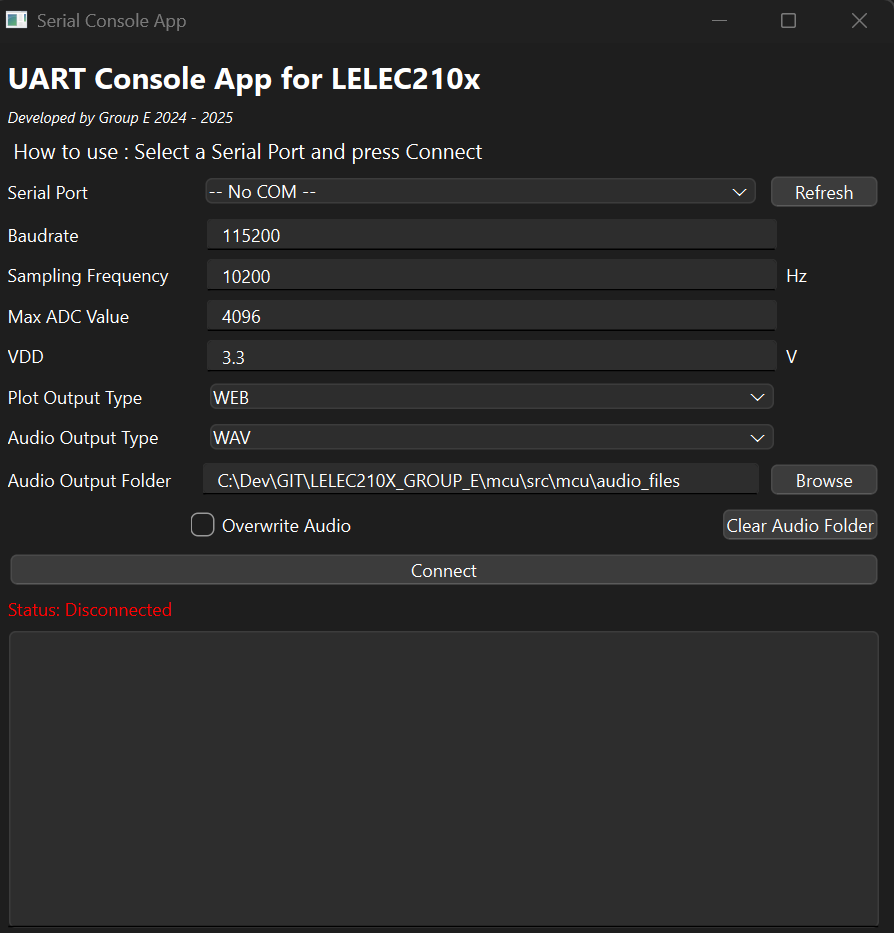

# Contributions

This package contains sub-packages that are contributions from students.

Teaching Assistants reviewed the code before merging, but are not responsible for it.

If you think you also have a piece of code that is worth adding to this project,
please do not hesitate to reach out (via a pull request or by contacting a teaching assistant)!

## List of contributions
- [Contribution 1 - UART Reader](#uart-reader)
  - [UART Reader Manual](#uart-reader-in-depth-manual)

## Contribution 1 - UART Reader

- **Location:** `src/contrib/uart_reader/__main__.py`;
- **Contributed by:** Group E, 2024-2025;
- **Description:** provide a graphical interface to read from UART;
- **Script(s):**
  - `uart-reader`, see usage below.
  - `model-trainer`, see usage below.

### Usage

Launching the UART Reader utility requires this command :

```bash
rye run uart-reader <optional flags>
```

To create a classification model that can be used by the UART Reader utilty requires the modification of the `src/contrib/uart_reader/model_trainer.py` file, and you must run this command for it to be correctly interpreted by the utility :

```bash
rye run model-trainer
```

> [!NOTE]
> The utility is for the moment only a GUI based application, and does not have the capacity to run only in the console. If you do need such an application, please refer to the tag bellow to a previous version of this application that has this feature.

### Optional Flags

<!--
@click.option(
    "--logfile",
    default="../uart_logs.log",
    help="Log file to write to",
)
@click.option("--opaudio", is_flag=True, help="Open the audio window")
@click.option("--opmel", is_flag=True, help="Open the MEL window")
@click.option("--modelfile", default="None", help="Classifier model to use")
@click.option("--mel_length", default=20, help="Length of the MEL vectors")
@click.option("--mel_number", default=20, help="Number of MEL vectors in the feature vector")
@click.option("--automel", is_flag=True, help="Automatically save the MEL files")
@click.option("--autoaudio", is_flag=True, help="Automatically save the audio files")
-->

<!-- TODO, update the text above to include the information below -->

### Making your own classifier

### Accessing the old stable version

<!--ADD TAG HERE-->
Please visit the tag <?> to use the previous version of the utility. This older version features a fully implemented and tested CLI interface, so that you can tie it to a command line pipeline. Though, it has only support for audio files, and not the interpretation of mel spectrograms.

<!-- TODO, Add a picture of the old utility here, and the command -->

---

---

# UART Reader, In Depth Manual

<!-- Chapter 0 - Wording -->

## Chapter 0 - Table of content, Terminology and wording

### Table of Contents

- [Contributions](#contributions)
  - [List of contributions](#list-of-contributions)
  - [Contribution 1 - UART Reader](#contribution-1---uart-reader)
    - [Usage](#usage)
    - [Optional Flags](#optional-flags)
    - [Making your own classifier](#making-your-own-classifier)
    - [Accessing the old stable version](#accessing-the-old-stable-version)
- [UART Reader, In Depth Manual](#uart-reader-in-depth-manual)
  - [Chapter 0 - Table of content, Terminology and wording](#chapter-0---table-of-content-terminology-and-wording)
    - [Table of Contents](#table-of-contents)
    - [Terminology](#terminology)
  - [Chapter 1 - Basic use of the utility](#chapter-1---basic-use-of-the-utility)
    - [Section 1.1 - Launching the GUI](#section-11---launching-the-gui)
    - [Section 1.2 - Launching the old utility](#section-12---launching-the-old-utility)
    - [Section 1.3 - Training and using your own classifier](#section-13---training-and-using-your-own-classifier)
    - [Section 1.4 - Changing parameters in the GUI](#section-14---changing-parameters-in-the-gui)
    - [Section 1.5 - Tips, tricks and known bugs](#section-15---tips-tricks-and-known-bugs)
  - [Chapter 2 - Advanced use and internals](#chapter-2---advanced-use-and-internals)
    - [Section 2.1 - Model trainer and abstract wrappers](#section-21---model-trainer-and-abstract-wrappers)
    - [Section 2.2 - GUI Architecture](#section-22---gui-architecture)
    - [Section 2.3 - Saving Graphs from the utility itself](#section-23---saving-graphs-from-the-utility-itself)
  - [Chapter 3 - Motivation, ideals and pushing development](#chapter-3---motivation-ideals-and-pushing-development)
    - [Section 3.1 - Motivation for creating the utility](#section-31---motivation-for-creating-the-utility)
    - [Section 3.2 - What could be improved ?](#section-32---what-could-be-improved-)
    - [Section 3.3 - Architectureal ideas](#section-33---architectureal-ideas)
    - [Section 3.4 - Credits and thanks](#section-34---credits-and-thanks)

### Terminology

We will use the following wording to discribe the different parts of the program.
| Term | Definition |
| ------------------------------- | ------------------------------------------------------------------------------------------------------------------------------------------------- |
| GUI                             | Graphical User Interface                                                                                                                          |
| CLI                             | Command Line Interface                                                                                                                            |
| ADC                             | Analog-to-Digital Converter                                                                                                                       |
| UART                            | Universal Asynchronous Receiver/Transmitter                                                                                                       |
| UART Reader/Utility/App/program | The uart-reader program that this manual talks about, its contained in `contrib/src/contrib/uart_reader/__main__.py`                              |
| Model Trainer                   | A script that creates a classification model file that can be used by the utility, situated in `contrib/src/contrib/uart_reader/model_trainer.py` |
| Optional Flags                  | The command line therms that have to be added to the end of the rye command for launching the utility, they follow the `--<name>` notation        |
| Pickling                        | The process of serializing and deserializing Python objects, converting them to a byte stream for storage or transfer, and restoring them later   |
| Database                        | The storage structure for the parameters such as the baud rate, the file paths, and the rest                                                      | 

<!-- Chapter 1 - Basic stuff-->

## Chapter 1 - Basic use of the utility

### Section 1.1 - Launching the GUI

To launch the GUI, you will need to use rye, or you could try to tweak the import chain to launch it, but its not recommended for simplicity. Rye will launch the main entry point and allows for a few optional therms that can be useful to go faster while using the utility.

To run the utility, please use :

```bash
rye run uart-reader <optional flags>
```

When you launch the GUI, by default, a uart_logs.log file will appear next to the `__main__.py` file. If you want to keep it, you will have to remove its exclusion in the .gitignore.

### Section 1.2 - Launching the old utility

The old uart-reader utility GUI had a CLI interface that the new one doesn't, but lacks the features of the new GUI interface. The old app was a bit snappier and simpler, only capable on processing audio from the hands_on_audio_acquisition. All of this makes it great for automatization and editability.

First, to obtain it, you will have to git checkout onto a tag in the project's origin. To do so, run this command :

<!--TODO : Add the tag-->

```bash
git checkout <tag name>
```

Then, you will have to run the utility using the following command :

```bash
rye run uart_reader <old optional flags>
```

The old optional flags where the following :

- `-c, --cli`: Whether to run the CLI application (runs the backend of the GUI, without the GUI itself).
- `-p, --port TEXT`: The serial port to read data from (default: `-- No COM --`).
- `-b, --baudrate INTEGER`: The baudrate of the serial port (default: `115200`).
- `-s, --sampling-frequency INTEGER`: The sampling frequency of the ADC (default: `10200`).
- `-m, --max-adc-value INTEGER`: The maximum value of the ADC (default: `4096`).
- `-v, --vdd FLOAT`: The voltage of the power supply (default: `3.3`).
- `-o, --plot-output-type [WEB|FILE]`: The type of output for the plot (default: `WEB`).
- `-l, --log-level [DEBUG|INFO|WARNING|ERROR|CRITICAL]`: The level of logging (default: `INFO`).
- `-f, --log-file`: Whether to log to a file (Not modifiable at runtime).
- `-w, --overwrite-audio`: Whether to overwrite the audio folder.
- `-a, --audio-output-type [WAV|OGG]`: The type of output for the audio (default: `WAV`).
- `-d, --audio-output-folder TEXT`: The folder to save the audio files (default: `audio_files`).

There where some instabilities with the serial port, as the `pyserial` package has a C backend, that is prone to occasional segfaults and other problems, that are not correctly handled in the old utility.

A thing to note is, that the utility did have a plotting function for the audio signals it received, but it was quite basic, as it would open a new plotly graph each time, which would tab out the user each time a audio packet is received. It will also save the audio automatically whenever its received into a `audio` folder

Here is a image of the old utility :

<p align="center">
    
</p>

### Section 1.3 - Training and using your own classifier

As each group is allowed to create anything they like as a classifier, i had to make a unified interface so that the UART Reader could use the classifier

<!-- TODO : DEVELOP FURTHER HERE-->

### Section 1.4 - Changing parameters in the GUI

### Section 1.5 - Tips, tricks and known bugs

<!-- Chapter 2 - Advanced stuff -->

## Chapter 2 - Advanced use and internals

### Section 2.1 - Model trainer and abstract wrappers

### Section 2.2 - GUI Architecture

### Section 2.3 - Saving Graphs from the utility itself
Currently, there is no way to save graphs directly from the GUI. So appart if you take screenshots of the graphs, i would recommend that you take the data from the `.npy` files, and that you plot them with your favourite aesthetic. 

A little tip here, is to use VSCode/VSCodium extension that allow for reading these files, so you can get a idea of what is inside them, sush as :
- `vscode-pydata-viewer` with `vscode-numpy-viewer` (Both are required)

<!-- Chapter 3 - Future development if need-be -->

## Chapter 3 - Motivation, ideals and pushing development

### Section 3.1 - Motivation for creating the utility

From the first week of the project, we found ourselves struggling to use correctly the uart-reader.py files with the different `hands_on`'s. We had time, and where motivated, so we wrote a GUI for it, so we could more easilly focus on the nitty gritty of the project. We then published it on the forum, that then led to a pull request, and after many revision (4 weeks of revisions), we finally contributed to the project. This program then became quickly obscolete as we learned about the mel spectrogram part, and the classification and authentification. We also had less and less time to work on it, so we left it as is. But after the midbreak between Q1 and Q2, we decided to rewrite it all, we went ahead and tried to make it more modular (serialUtils, loggingUtils, databaseUtils, ...). As we wrote and used more the modules, we could see where we could improve and we rewrote about 6 entire versions of the databaseUtils, before being kinda ok with it. But then the courses started again, and we had to finish it, so we scrambled to finish the only prototype closest to finish. This led to this version of the uart-reader program. That uses the V4 of the GUI, and the V2 of the database (as you can see, we didn't use the V6, as we would of have needed to rewrite too much, and we wanted it pulled as fast as possible for the Q2). All this has concluded in a mess of a codebase, but that works ok enough to be presentable.

After this big ramble, let me say that this was a very enjoyable experience, and tha twe learned a lot about how to build professional modular UI's that are easy to maintain and expand. I would definitely recommend you try it, if you have a light enough year, and want to learn more about UI's and user focused systems.

### Section 3.2 - What could be improved ?

Many things can be improved, but some more than others. One such thing, is definitely the separation between backend and frontend ! The mel window is a perfect example of what not to do, with a mish-mash of code to try to make something kinda performant. We could reformat it into the simple structure bellow :

<p align="center">
    
</p>
<!-- TODO : DEVELOP FURTHER HERE-->

### Section 3.3 - Architectureal ideas

### Section 3.4 - Credits and thanks
This manual and utility is provided to you by the following group(s) :
- Group E, 2024-2025

Big thanks to @jeertmans for his amazing help and guidance for the pull requests.

---
---
