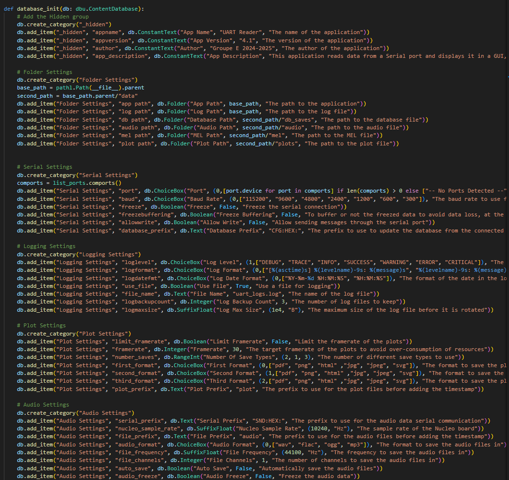
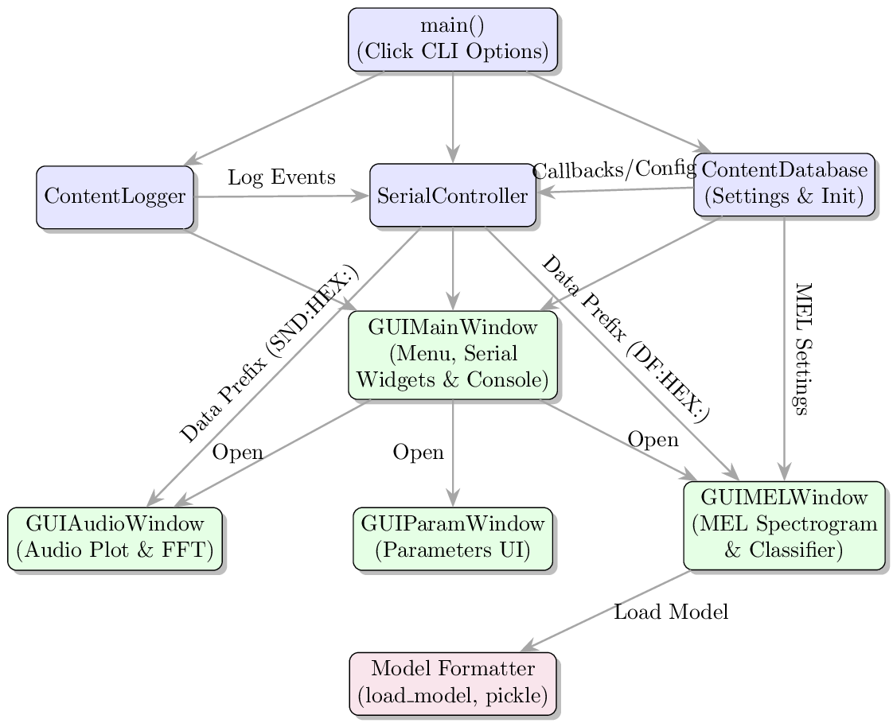

# Contributions

This package contains sub-packages that are contributions from students.

Teaching Assistants reviewed the code before merging, but are not responsible for it.

If you think you also have a piece of code that is worth adding to this project,
please do not hesitate to reach out (via a pull request or by contacting a teaching assistant)!

## UART Reader

- **Location:** `src/contrib/uart_reader.py`;
- **Contributed by:** group E, 2024-2025;
- **Description:** provide a graphical interface to read from UART;
- **Script(s):** `uart-reader`, see usage below.

### Usage

```bash
rye run uart_reader
```

> [!NOTE]
> The utility will launch in GUI mode by default, if needed in CLI mode, please use the `-c, --cli` flag.

### Options

- `-c, --cli`: Whether to run the CLI application.
- `-p, --port TEXT`: The serial port to read data from (default: `-- No COM --`).
- `-b, --baudrate INTEGER`: The baudrate of the serial port (default: `115200`).
- `-s, --sampling-frequency INTEGER`: The sampling frequency of the ADC (default: `10200`).
- `-m, --max-adc-value INTEGER`: The maximum value of the ADC (default: `4096`).
- `-v, --vdd FLOAT`: The voltage of the power supply (default: `3.3`).
- `-o, --plot-output-type [WEB|FILE]`: The type of output for the plot (default: `WEB`).
- `-l, --log-level [DEBUG|INFO|WARNING|ERROR|CRITICAL]`: The level of logging (default: `INFO`).
- `-f, --log-file`: Whether to log to a file (Not modifiable at runtime).
- `-w, --overwrite-audio`: Whether to overwrite the audio folder.
- `-a, --audio-output-type [WAV|OGG]`: The type of output for the audio (default: `WAV`).
- `-d, --audio-output-folder TEXT`: The folder to save the audio files (default: `audio_files`).

<!-- TODO, update the text above to include the information below -->

---

# UART Reader Manual

## How to use

### How to run the old version

Through rye :

> `rye run uart_reader`

Through python :

> `python3 uart_readerV1.py`

### How to run the new version

Through rye :

> `rye run uart_reader2`

Through python :

> `python3 uart_readerV4.py`

### Program entry point

The brand new uart-reader is the file named `uart_readerV4.py`, located next to this readme. This app allows the user to connect to a serial port, and liscen to it. When it receives certain packets, it can open one of 2 windows : Audio window, for audio packets from hands_on_audio_acquisition, and Mel window that is there to receive packets as mel vectors or full packets from the main app (only tested with the main app, usage may vary).

The Mel window has bugs (acknowledged further), its also the trickiest to use, as it requires the use of a classification model generated by the `model_formatter_for_V4.py` script to work. The window itself is the processor of everything, so, if a error has happened with the model, you just have to close and re-open the window to retry (If the program didn't crash).

### Re-define default settings

To redefine the default settings, please go to the `def database_initialization(db)` function, and change the values of the entries, be careful to not break the tuples, as the databaseV2 is a bit tricky in that aspect.



### Structure of the pickle file of the classifier model

Its structure is essentially just a dictionary containing the model and a bit more info to make it easy to run. You can generate such a pickled file using the `model_formatter_for_V4.py` file. It follows this convention :

```Python
pickled_data = {
    "model": AbstractModelWrapper, # The pre-trained classifier (fitted), and wrapped with a custom class of this type
    "mel_len": 20, # Length of the mel-vector of the feature vector
    "mel_num": 20, # Number of mel-vectors in the feature vector
    "classes": ["gun", "chainsaw", "bird", "fire"],
    "mel_flat": False, # Do you need it to be N*Mx1 of size (np.ndarray[]) or NxM size (np.ndarray[np.ndarray[]]) ?
    "needs_hist": False, # Does it need more than 1 melvec ?
    "concat_hist": False, # Does the history need to be concatenated after each feature vector ?
    "num_hist": 1, # Number of historical ellements to use, this is a maximum, if there are not enough, then i can't give you more.
}
```

Why use a custom wrapper for the model ? This is simply to let the user implement whatever they want as the backend, it only exposes a simple API to the application that it can follow. If you are not respecting this, then you could get problems.

### Instruction on use of the Mel Window (WARNING BUGS)

The mel window is the most patched up window in the whole program, as i had a hard time implementing it without a complete rewrite as i will explain further on in the document. This means that, if you want to use it with for example: a feature vector of 30x30 and a different model path, then you will first have to modify the parametters in the parametter window or initialization function for the database. Only then, can you open the Mel Window, and make the graphs work properly and not create errors or crash because of weird data formats (Because of how i had to implemement the UI).

## Internal Structure/Architecture of the `uart_readerV4`

Here is a very simple diagram of the architecture of the application, keep in mind that a lot of the complexities and problems can't really be seen from this view.


## Problems, Choices and future evolution

### State of the pushed app

Because of time and mental health constraints (i have rewritten too many times all of this) in 2025, i have decided to release only the uart_readerV4, and not the V5 as it was already further along in development (front and backend almost finished). The V4 is quite flawed, and is based on a flawed implementation of the database (V2) that made it hard to use. I had to be crafty in a lot of places to allow for certain features, and because of the bad database design, it was almost impossible to do proper cleanup and support for multiple windows. So crashes can easilly happen because of the callbacks.

### What i wanted to improve

After writing the V2 of the database, and using it in the V4 of the reader, i quickly realised that i was missing a lot of critical and tested implementations for each of the entries of the database (settings and stuff). This lead to the writing of the database V3. In this database, polymorphism was maximised, and a uniformity in the API was attempted, whilst trying to have as many type hints to know what to expect where. The only real issue i had with it is that there is apparently a problem with dark mode of Qt, making the text unreadable. In my optinion its perfectly capable, and and abstracts a lot of the complexities, whilst leaving a lot of functionality. But i will leave this to be fixed by whoever wants to use it. V3 was used to try to make the uart_readerV5, but this is still only the first brick of a skyscraper.

V4 of the database is a bit of a sketch version, as i tried to apply much more advanced concepts to it, and try to separate the API from the backed logick, while using python at its full potential (the code is probably still far off from peak python, and i also had to keep in mind to not use python 3.12+ features or very new stuff)

### If someone is up to it

I would recommend you to use the database V3 as its quite good, and has everything implemented and tested (even de serialization), whilst V4 still lacks quite a bit, but you do you.

One thing to keep in mind, is that the hardest part of this whole thing was probably the MEL vector part, its still giving me nightmares because of the fact that feature vectors can be NxM with N not always equal to M. And making it update with the rest of the things, gave me a headache.

Good luck to you if you take on this challenge.

### Ramble on the architecture to aim for

The perfect architecture is a architecture that devides the application into 2 independent parts (Frontend, backend), that can mutate at their own rate. For instance, if you made a graph, you would want to have the UI read a array in memory, and update itself using that array. And when you have to change the data of the array, you can change it as fast as you want, as the GUI will just handle it. This separation allows you to make clear procedural generation of the UI ellements at each update loop. It also allows you to change the underlying stuff, and re-render the whole ui with new parameters in a easier way. (Libraries such as dash, are faster and more oriented towards this paradigm; but Qt is fast enough, and much easier to use/read)

Another feature that is quite crititcal, but that is only handled by the latests versions of the database (V3 and V4). Is the ability to use callbacks, as they allows you to not only update the UI when some value/array or anything else changes, but also allows you to add custom handlers for when you have to pre-process stuff. Though, one word of warning, the database is meant for non dynamic storage, as its quite heavy, if you wanted to make for example a update to a dynamically assembled list of plots on the UI (You would have to delete them all, then create new ones or only delete some), by changing a array, then you would have to create something else than the database. As the overhead would be a bit too big, and i also haven't updated it.

## Authors (Expand as needed)

- Group E 2024-2025
- (Future You ?)
