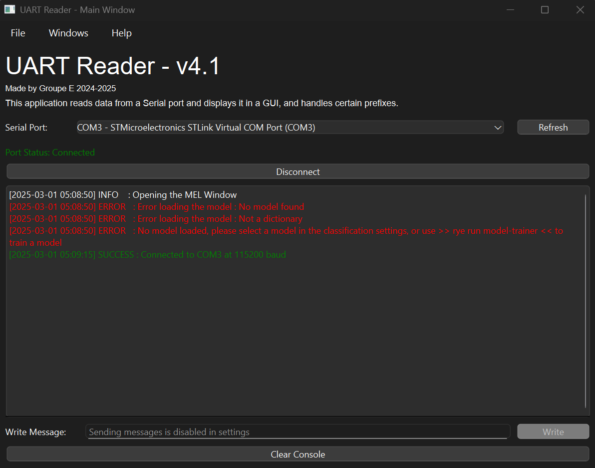
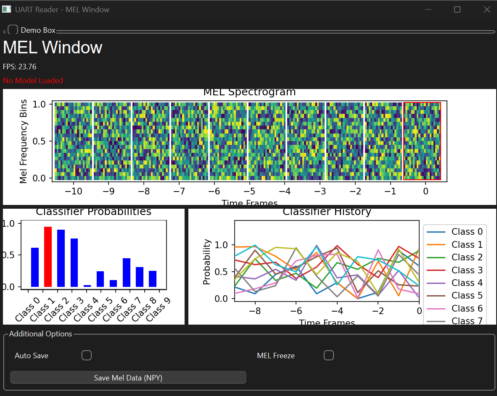

# UART Reader, In Depth Manual

<!-- Chapter 0 - Wording -->

## Chapter 0 - Table of content, Terminology and wording

### Table of Contents

- [UART Reader, In Depth Manual](#uart-reader-in-depth-manual)
  - [Chapter 0 - Table of content, Terminology and wording](#chapter-0---table-of-content-terminology-and-wording)
    - [Table of Contents](#table-of-contents)
    - [Terminology](#terminology)
  - [Chapter 1 - Basic use of the utility](#chapter-1---basic-use-of-the-utility)
    - [Section 1.1 - Launching the GUI](#section-11---launching-the-gui)
    - [Section 1.2 - Training and using your own classifier](#section-13---training-and-using-your-own-classifier)
    - [Section 1.3 - Changing parameters in the GUI](#section-14---changing-parameters-in-the-gui)
    - [Section 1.4 - Tips, tricks and known bugs](#section-15---tips-tricks-and-known-bugs)
  - [Chapter 2 - Advanced use and internals](#chapter-2---advanced-use-and-internals)
    - [Section 2.1 - Model trainer and abstract wrappers](#section-21---model-trainer-and-abstract-wrappers)
    - [Section 2.2 - GUI Architecture](#section-22---gui-architecture)
    - [Section 2.3 - Saving Graphs from the utility itself](#section-23---saving-graphs-from-the-utility-itself)
  - [Chapter 3 - Motivation, ideals and pushing development](#chapter-3---motivation-ideals-and-pushing-development)
    - [Section 3.1 - Motivation for creating the utility](#section-31---motivation-for-creating-the-utility)
    - [Section 3.2 - What could be improved ?](#section-32---what-could-be-improved-)
    - [Section 3.3 - Architectural ideas](#section-33---architectural-ideas)
    - [Section 3.4 - Credits and thanks](#section-34---credits-and-thanks)

### Terminology

We will use the following wording to describe the different parts of the program.
| Term | Definition |
| ------------------------------- | ------------------------------------------------------------------------------------------------------------------------------------------------- |
| GUI | Graphical User Interface |
| CLI | Command Line Interface |
| ADC | Analog-to-Digital Converter |
| UART | Universal Asynchronous Receiver/Transmitter |
| UART Reader/Utility/App/program | The `uart-reader` program that this manual talks about, it is contained in `<root>/contrib/src/contrib/uart_reader/__main__.py` |
| Model Trainer | A script that creates a classification model file that can be used by the utility, situated in `<root>/contrib/src/contrib/uart_reader/model_trainer.py` |
| Optional Flags | The command line arguments that can be added to the end of the uv command for launching the utility, they follow the `--<name>` notation |
| Pickling | The process of serializing and deserializing Python objects, converting them to a byte stream for storage or transfer, and restoring them later |
| Database | The storage structure for the parameters such as the baud rate, the file paths, and the rest |

<!-- Chapter 1 - Basic stuff-->

## Chapter 1 - Basic use of the utility

### Section 1.1 - Launching the GUI

To launch the GUI, you will need to use uv, or you could try to tweak the import chain to launch it, but it is not recommended for simplicity. uv will launch the main entry point and allows for a few optional terms that can be useful to go faster while using the utility.

To run the utility, please use :

```bash
uv run uart-reader <optional flags>
```

Here is the list of all optional flags (they are not needed, but can help save time) :
| Flag | Default | Description |
| ------------------------ | ------------------ | ------------------------------------------- |
| `--logfile <str/path>` | `../uart_logs.log` | Log file to write to |
| `--opaudio` | `False` (implicit) | Open the audio window when launching |
| `--opmel` | `False` (implicit) | Open the MEL window when launching |
| `--modelfile <str/path>` | `None` | Classifier model to use (None means default)|
| `--mel_length <int>` | `20` | Length of the MEL vectors |
| `--mel_number <int>` | `20` | Number of MEL vectors in the feature vector |
| `--automel` | `False` (implicit) | Toggle the automatic melvec saver |
| `--autoaudio` | `False` (implicit) | Toggle the automatic audio file saver |

> Implicit means that you only have to declare the flag, and it requires no other input

> [!TIP]
> When launching the GUI, by default, a `uart_logs.log` file will appear next to the `__main__.py` file. If you want to keep it in your repository, you will have to remove its exclusion in the `.gitignore`.

These 2 following images are the main GUI windows, you also have an audio window and a parameters window, but they are simpler and more straightforward, so we did not deem necessary to add them to the list of images.

<p align="center">
    
    
</p>

> [!WARNING]
> By default, while using the `uart-reader`, a [uart_logs.log](./src/contrib/uart_reader/uart_logs.log) file will be created, and will grow as you get packets and serial data. This file is local and alternates between 2 files, as it fills up, it will switch files when it reaches 5 MB. This file is at `<root>/contrib/src/contrib/uart_reader/uart_logs.log`.

### Section 1.2 - Training and using your own classifier

The main reason why a model trainer was needed here, was to unify all possible implementations through a singular interface that you can wrap around any model implementation. This led to a complex abstract class that you will have to implement like the example class provided.

When creating a model, you will have to create a `ModelPickleFormat` object, this object contains all the information that is needed for the `uart-reader` to be able to run comfortably the classification. Here is its structure :

```Python
class ModelPickleFormat:
    """Data structure for storing model metadata and parameters."""

    model:       AbstractModelWrapper  # Model wrapper object
    classes:     List[str]  # List of class labels
    mel_len:     int  # Mel vector length
    mel_num:     int  # Number of mel vectors
    mel_flat:    bool  # Whether mel vectors are flattened
    needs_hist:  bool  # Whether model needs history
    concat_hist: bool  # Whether history is concatenated
    num_hist:    int  # Number of history elements
```

As you can see, the model has a special structure abstraction that adds a unified interface for ease of use. This means that you will have to implement a few things to make everything work with your model. There are only **2** things that you **should modify or create** :

- A class implementation of `AbstractModelWrapper`
  - Implement the `__init__(self, model, classes)` with a `super().__init__(model, classes)` reference
  - Implement the serialization and deserialization with `__getstate__(self)` and `__setstate(self, state)` used for the pickling of the model (if the model is not from a pre-made library like sklearn)
  - Implement the prediction of a single melvec of size N x M `predict(self, X)`
  - Implement the prediction for a list of melvecs of size N x M `predict_hist(self, X:List)`
- The main training method in `main()`

> [!CAUTION]
> To run the trainer, you have to be very careful, due to problems with virtual environments and other python things, whenever you have used `save_model(model_format: ModelPickleFormat, path: str)`, the file becomes local to that version of python. This means that, if you used a VS Code extension or python3 to run the model-trainer, then you will not be able to run it in the `uart-reader` application, as its only executable through uv.

To run it, use this command :

```bash
uv run model-trainer
```

When opening the mel window, you could get 2 different errors (here with the example model):

- Model not trained using uv : ` Error loading the model : Can't get attribute 'DecisionTreeWrapper' on <module '__main__' from '[path]\.venv\Scripts\uart-reader.exe\__main__.py'>`
- Model not found : `Error loading the model : No model found`

For more information, please refer to [Section 2.1 - Model trainer and abstract wrappers](#section-21---model-trainer-and-abstract-wrappers), for ease of implementation and re-use of the model files in your own programs.

### Section 1.3 - Changing parameters in the GUI

The `uart-reader` utility is a bit tricky, as it is written with a naive database as its core, this made the parameter initialization not intuitive, so here is a breakdown of what you will have to do.

To edit default settings, you will have to modify the `database_init(db)` function (about 400 spaced lines). This function is responsible for the initialization of the entire database values, and the tricky part is the custom types it uses, as they were made too generalized, but not made the same, making it harder to use.

Here is a picture of the `database_init(db)`:

<p align="center">
    
</p>
> [!NOTE]
> We have expanded the functions intitializations to comply with good writing practices, this image was taken before this step

For the custom types, here are their basic structure :

```Python
class DatabaseElementTemplate:
    name:        str
    value:       Any # Tricky bit
    description: str
```

Now, for the value differences depending on the type:
| Database Element Type | Value Type | Description |
| --------------------- | ---------------------- | ------------------------------------------------------------------------------ |
| `SuffixFloat` | (float, str) | Represents a float with a suffix (e.g., 90MHz stored as (9e+7, "Hz")) |
| `Integer` | int | Represents an integer value |
| `RangeInt` | (int, int, int) | Represents an integer range as (value, min, max) |
| `RangeFloat` | (float, float, float) | Represents a float range as (value, min, max) |
| `Text` | str | Represents a text value |
| `Color` | (int, int, int) | Represents a color value as an RGB tuple (red, green, blue) |
| `Boolean` | bool | Represents a boolean value |
| `List` | list&lt;str&gt; | Represents a list of text values |
| `Dictionary` | dict&lt;str, str&gt; | Represents a dictionary of text values |
| `File` | pathlib.Path | Represents a file path |
| `Folder` | pathlib.Path | Represents a folder path |
| `ChoiceBox` | (int, list&lt;str&gt;) | Represents a choice box value, storing the current index and available choices |
| `ConstantText` | str | Represents constant text that does not change |

### Section 1.4 - Tips, tricks and known bugs

Tips:

- When training your model, if you name it `model.pickle`, and save it in the same folder as the `uart-reader` files, then it will automatically be detected and loaded by the mel window, and opened.

Bugs:

- When closing and re-opening the windows many times, undefined behavior may occur, as all the functions that trigger events to propagate UI changes stay in memory. Which has an undefined behavior.
- If you have trained the model with python3 or a VS Code extension instead of doing `uv run model-trainer`, then the utility that was launched with `uv run uart-reader` won't be able to find it.
- There is an import error when trying to launch the program with something else than uv.

<!-- Chapter 2 - Advanced stuff -->

## Chapter 2 - Advanced use and internals

### Section 2.1 - Model trainer and abstract wrappers

The model-trainer has a much simpler architecture than the main app, as its focus if to be modified by others. Here is an overview of this structure :

<p align="center">
    
</p>

Because of this structure, the pickling requires serialization and deserialization using the same classes, classes are bound to libraries. And if you compile it using python3 or a VS Code extension, you will be adding in the pickled (serialized) file, references to classes that are not in the same library as per se. Because of that, you have to use the same environment as uv to create the models.

### Section 2.2 - GUI Architecture

The app truly only has a separation of database as backend and everything else as frontend, even the processing. This is a flawed architecture, but it works, and we were pressed on time. The app is divided in 3 windows plus one to edit the database. The first window is the main window, that is called with `main()`, and handles the UI and the access to other features of the app. It displays the serial feed, and launches the appropriate window depending on which serial packet has been received. We then have the audio window, that displays the sound intensity, and the FFT of that sound for quick analysis. You can save the raw data in multiple types of files. The final important window is the mel spectrogram window, that receives mel-spectrograms (or full packets) and displays them in from right to left depending on the past history (the newer ones are on the right). Then, you have the 2 classification graphs, that use the classifier generated from the model-trainer, and shows you a bar-chart of the current probabilities of the classes and histogram of past probabilities also from right to left.

Here is an overview of the architecture of the whole app :

<p align="center">
    
</p>

The architecture of the mel window is cleaner on the graph than in reality, as everything is executing inside the window instead of having a clear separation backend-frontend. Here is a schema of the architecture of the mel window as it is the other most complex system, that requires a little more details :

<p align="center">
    
</p>

Through the writing of the mel window, we have tried our best to make it as robust to unexpected things as possible, but because of how we used a flowed based to write it, we had problems with trying to make the proper checks and proper handling.

A few words on the database architecture, we have used a system where, whenever a value is changed, it will trigger callbacks (functions to handle the change), these callbacks range from updating the UI elements through different UI windows, to changing settings in other modules.

Let's talk about the file structure, the `uart-reader` has its entry point in `__main__.py`, and uses `__version__.py` to read the version of the application. It then imports 3 custom modules situated in `libraries/` and are the following :

- `database_utils.py` : Implementation of the database, with all its elements.
- `logging_utils.py` : Unification of the logging system, and abstraction of the configurations and other aspects.
- `serial_utils.py` : Implementation of a serial thread, where the serial port communicates using `qtSignal`'s, and handles all the edge cases where the port has to disconnect or got suddenly disconnected.

When uv calls the utility, it will call the `main()` of `__main__.py`, and give click (the argument/flags parser) the options given by the user. If you call the application using python3 or a VS code extension, then you will have an import problem, we have yet to find a way to fix this problem, if you find a solution, don't hesitate to make a pull request to fix it.

### Section 2.3 - Saving Graphs from the utility itself

Currently, there is no way to save graphs directly from the GUI. So apart if you take screenshots of the graphs, I would recommend that you take the data from the `.npy` files, and that you plot them with your favorite aesthetic.

A little tip here, is to use VS Code extension that allow for reading these files, so you can get an idea of what is inside them, such as :

- `vscode-pydata-viewer` with `vscode-numpy-viewer` (Both are required)

<!-- Chapter 3 - Future development if need-be -->

## Chapter 3 - Motivation, ideals and pushing development

### Section 3.1 - Motivation for creating the utility

From the first week of the project, we found ourselves struggling to use correctly the uart-reader.py files with the different `hands_on`'s. We had time, and where motivated, so we wrote a GUI for it, so we could more easily focus on the nitty-gritty of the project. We then published it on the forum, that then led to a pull request, and after many revision (4 weeks of revisions), we finally contributed to the project. This program then became quickly obsolete as we learned about the mel spectrogram part, and the classification and authentication. We also had less and less time to work on it, so we left it as is. But after the mid-break between Q1 and Q2, we decided to rewrite it all, we went ahead and tried to make it more modular (`serialUtils`, `loggingUtils`, `databaseUtils`, ...). As we wrote and used more the modules, we could see where we could improve, and we rewrote about 6 entire versions of the `databaseUtils`, before being kinda ok with it. But then the courses started again, and we had to finish it, so we scrambled to finish the only prototype closest to finish. This led to this version of the `uart-reader` program. That uses the V4 of the GUI, and the V2 of the database (as you can see, we didn't use the V6, as we would have needed to rewrite too much, and we wanted it pulled as fast as possible for the Q2). All this has concluded in a mess of a codebase, but that works ok enough to be presentable.

After this big ramble, let me say that this was a very enjoyable experience, and that we learned a lot about how to build professional modular UI's that are easy to maintain and expand. I would definitely recommend you try it, if you have a light enough year, and want to learn more about UI's and user focused systems.

### Section 3.2 - What could be improved ?

Many things can be improved, but some more than others. One such thing, is definitely the separation between backend and frontend ! The mel window is a perfect example of what not to do, with a mishmash of code to try to make something kinda performant.

In this section, we will suggest the following architecture for a more robust and responding app, optimized for desktop machines and not the web :

<p align="center">
    
</p>

Another thing to be improved is the database, or more correctly said, the parameter storage of the program. To start with, we could ditch the entire callback system that is more appropriate for advanced efficient web apps. Instead, we could take advantage of the settings backup into a file to schedule UI updates, or if need be, make it create a `qtSignal` with the name of the thing that changes for inter UI synchronization, but this is just an absurd way of doing things. As you could just sync the data when the user presses save, or when he finished editing the value of a UI element (text elements can call callbacks for each character you type, and sometimes more depending on the keyboard). This would be the static database block in the proposed app architecture.

Something mentioned above, is that we could save the parameters in a file, so they are persistent between session. If we really wanted to make a nightmare of a program, we could even use registry keys to save parameters, but this is more than overkill for such a simple python app. So we will consider using a file, but there are many formats that are available. I would suggest here the use of YAML, as it is a pretty modern, easy to read and compact system that goes beyond what JSON can do, but is not as annoying to write to as XML.

One of the bottlenecks we have when creating graphs, is how do you update it fast enough so that data can be buffered and rendered ? Simple ! Use a limited size queue of about 100 to 1000 elements (memory constraints need to be considered), to store the influx of data, and discard old data. This way, you can buffer then write a bunch of files at once, instead of making your file manager try to keep up with the fast data rates. And since you have historic data, you can then just make a small agent thread that processes that data, and passes it to another limited queue, that then could be rendered at 30FPS for example. This is exactly the situation of the mel window, so we solve many of the problems there. In the proposed architecture, this would be the dynamic database block.

Let's now talk about the serial thread, it uses `pyserial`, a wrapper for a C library. Because it is written in C, it can sometimes have segfaults and other issues due to how it works. What i would suggest here, is to wrap it in as many try-except as possible, and of course log everything back to the user. Also, you will have to make it have a simple interface with at least 4 functions : `connect(port)`, `disconnect()`, `reconnect()`, `configure(config)`. With arguably, having the configuration function use reconnect to change settings such as the baud rate, etc.

Another block to consider is the logging part, it consists of 3 streams of information : GUI, CLI and Log File. You don't necessarily want the same information everywhere at the same time, but the `logging` library is sometimes hard to use for this, as it was not meant for a interactive reconfiguration (you would have to unregister handlers, and it will be utter chaos). So here I would say that you should implement it yourself, this way, you can send to the GUI only the normal serial text (without stuff like `DF:HEX:`, that can be handled elsewhere in the program). You can push everything to the CLI, and the logging file, though, you will have to manage the files. For instance, if the user wants or not the file, if they want a new file each time they start the application with a maximum of N files (deletes older ones), or if they wanted to limit the size of the log files, so it can overspill onto a new file.

Now, let's discuss the graphs, here we can use `QtGraphs` for a native implementation of the graphs, the big advantage here is speed in exchange for aesthetics (if we consider the quick fix of `matplotlib` "aesthetic"). Here, we can derive multiple things, first, a graph is a heavy operation that has to update very fast, such a graph must also be readable, and convey all needed information. We can also add statistics such as the mean, variance, entropy, linearity, etc. These statistics allow for quicker analysis of the signals and spectrograms, and can be essential in verifying theories. Also, the user may need to save the raw data or even want to plot a `matplotlib` plot that is well-made. On this last part, I would suggest the creation of a window that allows for the formatting of data for a `matplotlib` plot in a very interactive way, maybe even using `fastplotlib` to allow for real time controls for the following operations : cropping, centering, smoothing, extrapolating, assembling, composing, renaming, scaling, etc. All these operations allow the user to make custom plots faster, of course, this could be tied to the YAML parameters from the static database to save the user's preferences, and you could also make a unified wrapper that the user can then use to make their own plots instead.

We will list more ideas as bullet points in the next section.

### Section 3.3 - Architectural ideas

After many rewrites, we have had a few other ideas that we wanted to add, though, we felt that developing them further in text would just be wasteful, so here are a few more ideas that are slightly closer to the code :

- Use YAML files to define and save the database, use a `.yaml.distribute` in a `distribute` folder, where only the definition of the database parameters is located, with default values. You then use `pyyaml` to read this file, and create a version unique to that user, that they can edit. This means that there won't be import/export buttons, but probably only a CLI flag.
- Make an automatically synchronized database, in the sense that every 1s that something has changed, you save into the file, apart if the user presses the "save params" button to force the procedure. You can then turn off this feature by unchecking a parameter for the real-time sync of the YAML file.
- Make a separation between a "static" and "dynamic" databases, the static database, is for parameters, it is meant to be accessed more than written to. Whilst the dynamic database, is meant for high data flow, such as the storage of mel-spectrograms, audio signals, ... This dynamic system is meant to be a sort of limited queue, where very old things will be forgotten if over a certain amount of them. This way, we can keep the separation between data and GUI. And even make a storage manager for save files of that data, if need be (for higher efficiency and fewer errors due heavy file calls).
- Make a clear separation between the DATA and GUI, never mix them up, and make each window be the one to `get` and `set` data, instead of callbacks (or only one callback signal that is easy to remove later), so that you can have defined behavior when opening multiple windows and close some of them. Without having to make a window event manager to properly close and deallocate memory, as we are using python and not C.
- Use more specialized libraries for the graphs and other elements, such as `QtGraphs` or `fastplotlib`. These libraries are designed for speed, and when the user wants to save the graph, you could call a new window titled "Plot Editing Window" that focuses on giving the user the ability to edit the graph by cropping it, smoothing it, changing its color, its axes, title, add comments, etc. Such a window could also be called for a list of signals or values such as the classification history. You should also make it possible to save mel-spectrograms that are received as images, such as PNG, SVG, JPEG or GIF.
- Use a thread pool for the classification model, so that you can have many tasks that can be processed at the same time when they get received. Show the progress of running it using `QLoadingBar`'s, and use the estimated time for a run of the classifier as the completion percentage, when it is done, change its color from blue to green or something similar. This shouldn't be too hard to do.
- Use `RLock` instead of `Lock`, as it allows for speedups inside the main thread where it was called, as that thread can't mess it up.
- Make a serial thread that can be disconnected and reconnected when parameters change, and add a port blacklist to it, so that, user with Wi-Fi cards with serial ports (Intel cards) can skip these cards during the auto selection of the port when ports are detected.
- Startup times are slow, to speed them up, you could try to first load part of the backend that does not require a lot of libraries, and launch the main window. Then, you can import the rest of the libraries on a thread and launch the rest of the backend and frontend. But this will be very hard to implement correctly for a minimal speedup. Another option is to use JIT (Just in time compilation) using `numba`, but this won't work on all functions, and is harder to use, and could cause pickling problems if used in a multicore system (by experience).

### Section 3.4 - Credits and thanks

This manual and utility is provided to you by the following group(s) :

- Group E, 2024-2025

Big thanks to @jeertmans for his amazing help and guidance for the pull requests.
